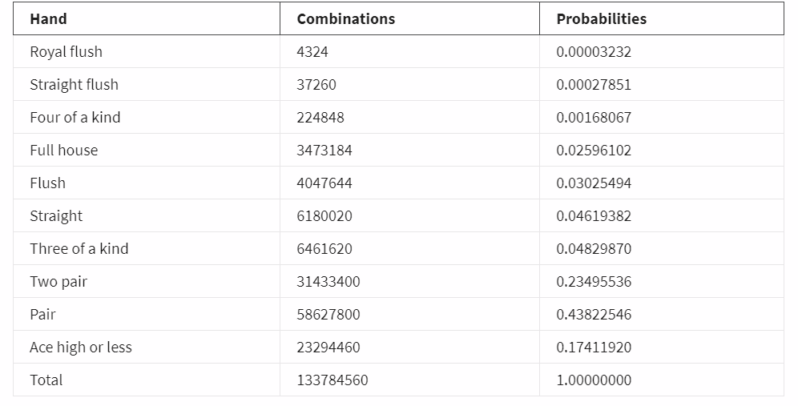

> cmake-build-debug 、cmake-build-release ./idea 
> 可以刪除
# PROMPT 題目
> 用C語言寫玩德州撲克的牌組，並統計機率，規則如下

Use a struct to define a card as an enumerated member that is its suit value and a short that is its pips value.

Write a function that randomly shuffles the deck.

Submit your work as a text file.

Then deal out 7 card hands and evaluate the probability that a hand has no pair, one pair, two pair, three of a kind, full house and 4 of a kind.  This is a Monte Carlo method to get an approximation to these probabilities.  Use at least 1 million randomly generated hands.

You can check against probabilities found in a standard table.

Seven-Card Stud

> 中文翻譯
1. 使用一個枚舉類型來表示撲克牌的花色（例如：黑桃、紅心、梅花、方塊）。使用一個short int 變量來表示點數（例如：2到10，J，Q，K，A）。
   編寫洗牌函數：
2. 隨機打亂一副牌的順序。
   發牌並評估手牌：
3. 隨機發出七張牌的手牌。
   使用蒙特卡洛方法模擬至少100萬個隨機手牌，計算各種手牌（例如：無對、一對、兩對、三條、滿堂紅、四條）的出現概率。
# result
```shell
Royal flush: 4428 (0.00003310)
Straight flush: 20366 (0.00015223)
Four of a kind: 225712 (0.00168713)
Full house: 3417605 (0.02554559)
Flush: 4063804 (0.03037573)
Straight: 5571765 (0.04164729)
Three of a kind: 6523800 (0.04876347)
Two pair: 31454348 (0.23511194)
One pair: 58873780 (0.44006409)
High card: 23628952 (0.17661942)
Total: 133784560
Sum of all probabilities: 1.00000000
```
